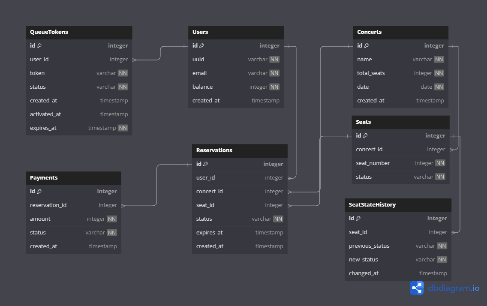

# 데이터베이스 테이블 설명

## Users 테이블
사용자 정보를 저장하는 테이블입니다.
- `id`: 사용자의 고유 식별자
- `uuid`: 사용자의 고유 식별 문자열
- `email`: 사용자의 이메일 주소
- `balance`: 사용자의 계정 잔액
- `created_at`: 계정 생성 시간

## Concerts 테이블
콘서트 정보를 저장하는 테이블입니다.
- `id`: 콘서트의 고유 식별자
- `name`: 콘서트 이름
- `total_seats`: 총 좌석 수
- `date`: 콘서트 날짜
- `created_at`: 콘서트 정보 생성 시간

## Seats 테이블
콘서트의 개별 좌석 정보를 저장하는 테이블입니다.
- `id`: 좌석의 고유 식별자
- `concert_id`: 연관된 콘서트의 ID
- `seat_number`: 좌석 번호
- `status`: 좌석 상태 (이용가능, 임시예약, 예약완료)

## Reservations 테이블
사용자의 좌석 예약 정보를 저장하는 테이블입니다.
- `id`: 예약의 고유 식별자
- `user_id`: 예약한 사용자의 ID
- `concert_id`: 예약된 콘서트의 ID
- `seat_id`: 예약된 좌석의 ID
- `status`: 예약 상태 (임시예약, 예약확정, 취소됨)
- `expires_at`: 임시 예약의 만료 시간
- `created_at`: 예약 생성 시간

## Payments 테이블
결제 정보를 저장하는 테이블입니다.
- `id`: 결제의 고유 식별자
- `reservation_id`: 연관된 예약의 ID
- `amount`: 결제 금액
- `status`: 결제 상태 (대기중, 완료됨, 실패)
- `created_at`: 결제 시도 시간

## QueueTokens 테이블
대기열 토큰 정보를 저장하는 테이블입니다.
- `id`: 토큰의 고유 식별자
- `user_id`: 토큰을 발급받은 사용자의 ID
- `token`: 고유한 토큰 문자열
- `status`: 토큰 상태 (대기중, 활성화, 사용됨, 만료됨)
- `created_at`: 토큰 생성 시간
- `activated_at`: 토큰 활성화 시간
- `expires_at`: 토큰 만료 시간

## SeatStateHistory 테이블
좌석 상태 변경 이력을 저장하는 테이블입니다.
- `id`: 상태 변경 기록 고유 식별자입니다.
- `seat_id`: 상태 변경이 발생한 좌석의 ID입니다. Seats 테이블의 id를 참조합니다.
- `previous_status`: 상태 변경 전 좌석의 상태입니다.
- `new_status`: 상태 변경 후 좌석의 상태입니다.
- `changed_at`: 상태 변경이 발생한 시간입니다.
