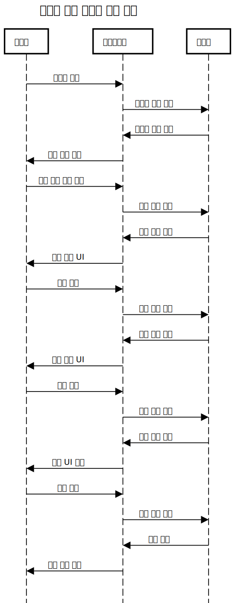
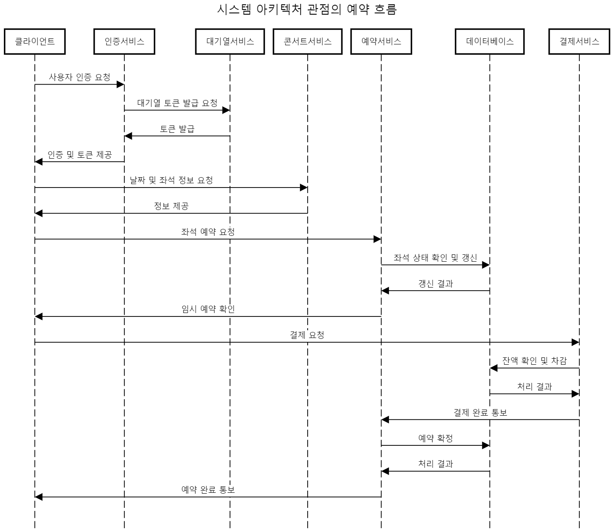
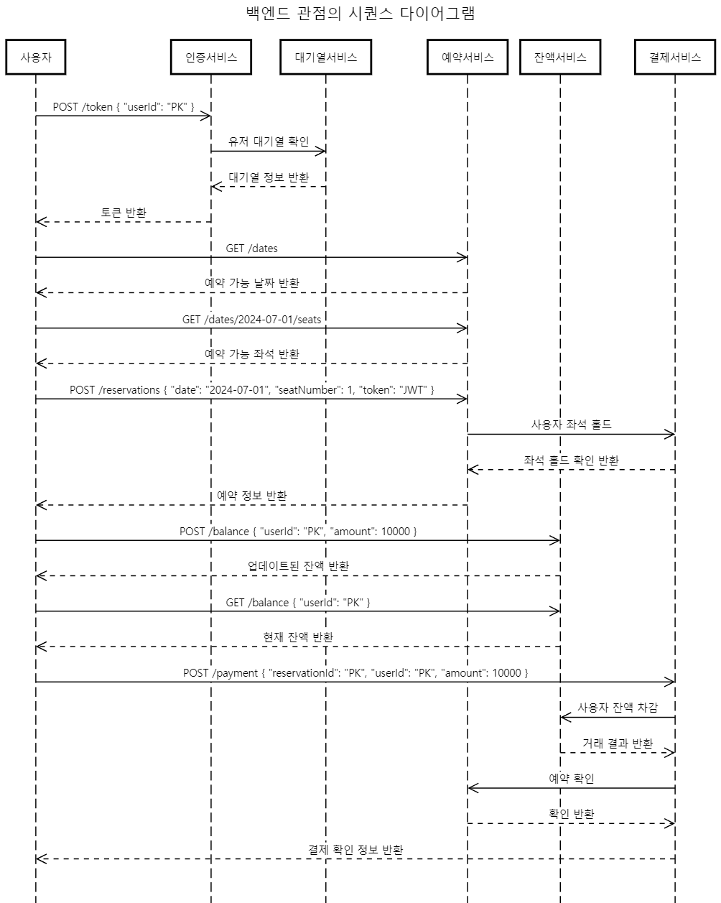

# 콘서트 예약 서비스 시퀀스 다이어그램

## 목차
1. [전체 서비스 흐름](#1-전체-서비스-흐름)
2. [백엔드 구현 관점의 예약 프로세스](#2-백엔드-구현-관점의-예약-프로세스)
3. [시스템 아키텍처 관점의 예약 흐름](#3-시스템-아키텍처-관점의-예약-흐름)

## 1. 전체 서비스 흐름

이 다이어그램은 사용자의 관점에서 콘서트 예약 서비스의 전체 흐름을 보여줍니다.

## 2. 백엔드 구현 관점의 예약 프로세스

이 다이어그램은 백엔드 개발자의 관점에서 예약 프로세스의 상세한 흐름을 보여줍니다.

## 3. 시스템 아키텍처 관점의 예약 흐름

이 다이어그램은 시스템 아키텍트의 관점에서 예약 흐름의 전체 아키텍처를 보여줍니다.

